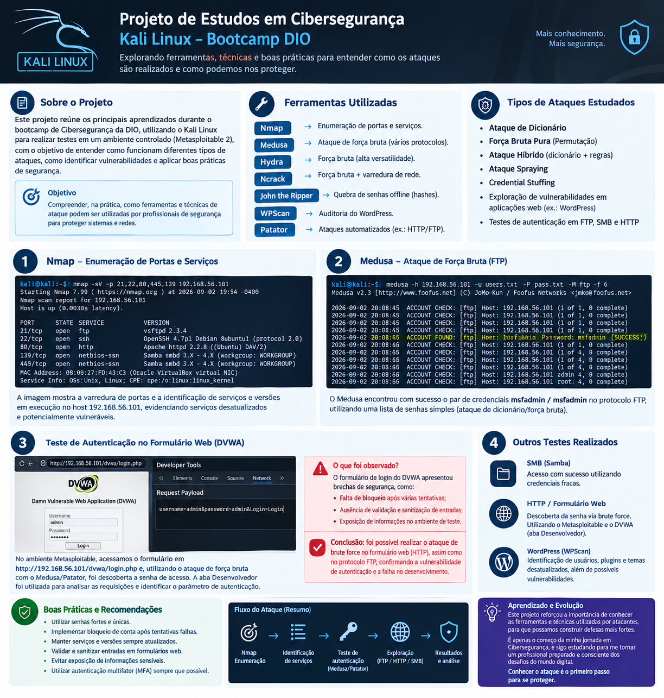
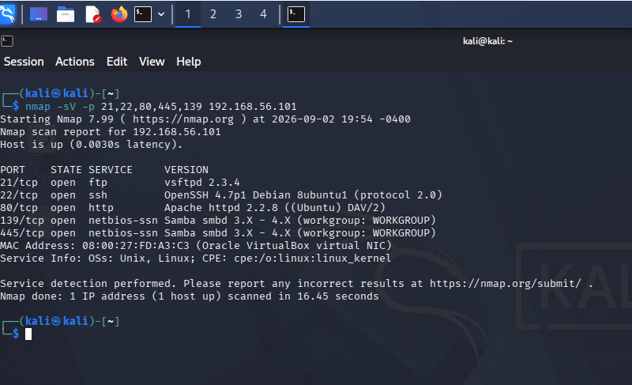
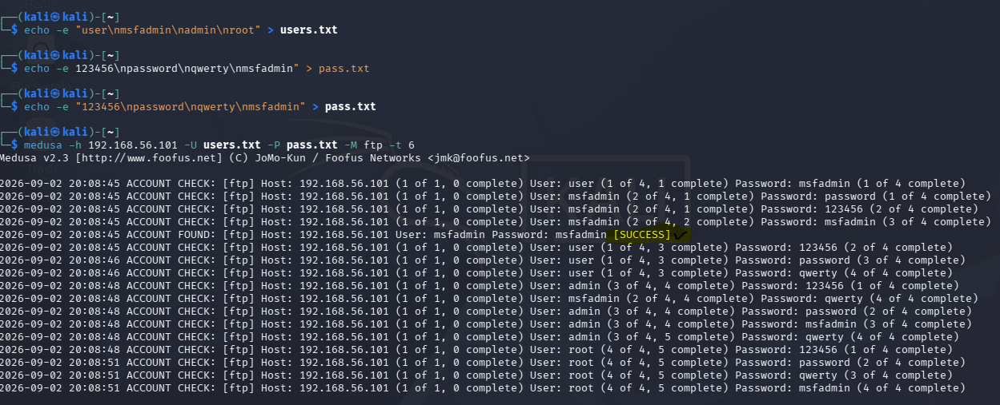

# Projeto de Cibersegurança --- Kali Linux: Enumeração e Testes de Autenticação

> **Projeto desenvolvido em ambiente de laboratório controlado, com
> finalidade exclusivamente educacional e de aprendizado em
> Cibersegurança.**
>
> Os testes descritos devem ser realizados somente em sistemas próprios
> ou com autorização explícita.



*Infográfico-resumo dos conceitos, ferramentas, testes e recomendações estudados.*

## 1. Objetivo

Este projeto apresenta os principais conhecimentos adquiridos durante os
estudos de Cibersegurança com **Kali Linux**, com foco em:

-   enumeração de serviços;
-   identificação de serviços potencialmente vulneráveis ou
    desatualizados;
-   compreensão de ataques de autenticação;
-   utilização da ferramenta **Medusa** em ambiente de laboratório;
-   análise dos riscos relacionados a senhas fracas;
-   aplicação de medidas de proteção.

O laboratório utilizado permitiu observar, na prática, como serviços
expostos, versões antigas e credenciais previsíveis podem aumentar
significativamente o risco de comprometimento.

------------------------------------------------------------------------

## 2. Conceitos de ataques de autenticação estudados

### Ataque de dicionário

Utiliza arquivos de texto chamados **wordlists**, contendo centenas ou
milhares de palavras, senhas comuns e informações que podem ter sido
expostas em vazamentos.

A ferramenta automatiza as tentativas utilizando as entradas da lista.
Senhas previsíveis como `123456`, `password` e outras combinações comuns
aumentam a possibilidade de sucesso.

### Força bruta pura

Tenta combinações de caracteres até encontrar a senha correta.

O tamanho da senha influencia diretamente a quantidade de combinações.
Por isso, senhas maiores e complexas tornam esse processo
significativamente mais difícil.

### Ataque híbrido

Combina uma wordlist com modificações nas palavras para representar
padrões comuns utilizados pelas pessoas.

Exemplos estudados:

-   **Mangling Rules:** alterações como `Password` → `P@ssw0rd`;
-   **Junção de listas:** combinação de informações de diferentes
    listas, como nomes e datas.

### Password Spraying

Em vez de testar muitas senhas contra um único usuário, utiliza uma
senha comum contra vários usuários. Essa estratégia busca reduzir a
possibilidade de bloqueio de uma única conta.

### Credential Stuffing

Explora o reaproveitamento de credenciais. Quando uma combinação de
usuário e senha é obtida por vazamento ou outro meio, ela pode ser
testada em outros serviços nos quais a mesma senha tenha sido
reutilizada.

------------------------------------------------------------------------

## 3. Ferramentas estudadas no Kali Linux

  -----------------------------------------------------------------------
  Ferramenta                          Finalidade estudada
  ----------------------------------- -----------------------------------
  **Hydra**                           Testes automatizados de
                                      autenticação em diversos protocolos
                                      e serviços.

  **Ncrack**                          Testes de autenticação associados à
                                      enumeração de serviços e múltiplos
                                      hosts.

  **John the Ripper**                 Análise offline de hashes e testes
                                      de resistência de senhas.

  **WPScan**                          Auditoria de instalações WordPress,
                                      incluindo identificação de
                                      componentes e vulnerabilidades
                                      conhecidas.

  **Patator**                         Testes altamente configuráveis em
                                      diferentes protocolos, inclusive
                                      cenários envolvendo formulários
                                      Web.

  **Medusa**                          Testes de autenticação em rede, com
                                      suporte a múltiplos protocolos e
                                      execução de tentativas em paralelo.
  -----------------------------------------------------------------------

### Destaque: Medusa

O **Medusa** foi a principal ferramenta utilizada nos experimentos.

O estudo mostrou que a ferramenta pode realizar várias tentativas
simultaneamente (**multithread**), aumentando a velocidade dos testes.
Entre os protocolos estudados estão FTP, SSH, SMB, HTTP, RDP, POP3, SMTP
e TELNET.

Para formulários Web dinâmicos, as anotações destacam que ferramentas
como **Patator** e **Burp Suite** podem ser mais adequadas em
determinados cenários.

------------------------------------------------------------------------

## 4. Laboratório 1 --- Enumeração e serviço FTP

### 4.1 Enumeração

A primeira etapa de uma auditoria é descobrir quais serviços estão
disponíveis no sistema-alvo.

No laboratório foi utilizado:

``` bash
nmap -sV -p 21,22,80,445,139 192.168.56.101
```

O parâmetro `-sV` permite identificar a versão dos serviços encontrados.

### Resultado observado

O Nmap identificou:

-   **21/tcp --- FTP --- vsftpd 2.3.4**
-   **22/tcp --- SSH --- OpenSSH 4.7p1**
-   **80/tcp --- HTTP --- Apache httpd 2.2.8**
-   **139/tcp --- netbios-ssn --- Samba**
-   **445/tcp --- netbios-ssn --- Samba**

O resultado evidencia a presença de serviços e versões antigas, o que
representa um importante ponto de atenção em uma auditoria de segurança.



### 4.2 Verificação do FTP

Foi realizada a conexão com o serviço:

``` bash
ftp 192.168.56.101
```

A possibilidade de estabelecer a conexão confirmou que o serviço FTP
estava acessível. Entretanto, naquele momento, as credenciais não eram
conhecidas.

### 4.3 Teste de autenticação com Medusa

Foram criadas listas de usuários e senhas para representar credenciais
comuns em um ambiente de laboratório:

``` bash
echo -e "user\nmsfadmin\nadmin\nroot" > users.txt
echo -e "123456\npassword\nqwerty\nmsfadmin" > pass.txt
```

Em seguida, foi executado o teste no serviço FTP:

``` bash
medusa -h 192.168.56.101 -U users.txt -P pass.txt -M ftp -t 6
```

O parâmetro `-t 6` foi utilizado para realizar múltiplas tentativas em
paralelo.

### Resultado

O laboratório demonstrou sucesso ao encontrar a combinação:

``` text
Usuário: msfadmin
Senha:   msfadmin
```



**Principal aprendizado:** credenciais simples e previsíveis podem
transformar um serviço exposto em uma porta de entrada para outros
recursos.

------------------------------------------------------------------------

## 5. Laboratório 2 --- Teste de formulário Web

Também foi realizado um teste de autenticação em um formulário Web no ambiente de laboratório **Metasploitable**, utilizando a aplicação **DVWA (Damn Vulnerable Web Application)**:

```text
http://192.168.56.101/dvwa/login.php
```

O objetivo foi compreender como os dados do formulário são enviados ao servidor e verificar, em um ambiente controlado, se a aplicação apresentava brechas que permitissem tentativas automatizadas de autenticação.

### Análise com o navegador

Foi utilizado o modo **Desenvolvedor** do navegador (`F12`):

1. Acessar a aba **Network**;
2. realizar uma tentativa de login;
3. localizar a requisição **POST**;
4. analisar os parâmetros enviados em **Request**.

Essa análise permitiu compreender como os campos de usuário e senha eram encaminhados pelo formulário e como a aplicação informava uma autenticação inválida.

### Teste de força bruta no formulário

A estratégia estudada no FTP também foi aplicada ao protocolo **HTTP**, adaptando os parâmetros ao formulário Web:

```bash
medusa -h 192.168.56.101 -U users.txt -P pass.txt -M http \
-m PAGE:'/dvwa/login.php' \
-m FORM:'username="USER"&password="PASS"&Login=Login' \
-m 'FAIL=Login failed' -t 6
```

### Resultado

**O teste teve sucesso:** a estratégia de força bruta conseguiu descobrir uma credencial válida no formulário Web da DVWA.

Assim, o laboratório demonstrou que o mesmo princípio de tentativas automatizadas utilizado contra o **FTP** também pode funcionar contra uma autenticação via **HTTP**, quando a aplicação não possui controles suficientes contra esse tipo de tentativa.

### Falha de segurança observada

O exercício evidenciou falta de cuidados de segurança no desenvolvimento do formulário, facilitando a automação das tentativas de login. Os principais pontos observados foram:

- ausência de limitação adequada de tentativas;
- ausência de bloqueio temporário após várias falhas;
- possibilidade de automatizar o envio de diferentes credenciais;
- mecanismos insuficientes para dificultar ataques automatizados.

Isso reforça a importância de **segurança desde o desenvolvimento**. Um formulário não deve ser tratado apenas como uma funcionalidade: é necessário implementar controles de autenticação, proteção contra automação e monitoramento.

> **Aprendizado:** a aba Desenvolvedor foi essencial para entender a requisição HTTP e adaptar o teste ao comportamento real da aplicação.

## 6. Laboratório 3 --- SMB e Password Spraying

O terceiro cenário abordou o protocolo **SMB**, utilizado para
comunicação e compartilhamento de recursos em ambientes Windows e Linux.

O estudo foi dividido em três etapas:

### Etapa 1 --- Enumeração

Foi utilizada a enumeração para identificar serviços disponíveis e
possíveis pontos de atenção no alvo.

### Etapa 2 --- Password Spraying

Foram criados arquivos contendo usuários e senhas comuns para
representar um cenário de laboratório:

``` text
smbusers.txt
senhas-spray.txt
```

O conceito demonstrado foi o uso de uma senha comum contra vários
usuários, em vez de realizar muitas tentativas contra uma única conta.

### Etapa 3 --- Acesso ao SMB

Após o teste, foi utilizado:

``` bash
smbclient -l //192.168.56.101 -U msfadmin
```

O laboratório registrou **sucesso no acesso**, reforçando o risco
causado pela combinação de credenciais fracas e serviços inadequadamente
configurados.

------------------------------------------------------------------------

## 7. Principais aprendizados

Os experimentos mostraram que ataques sofisticados nem sempre são
necessários para causar problemas.

Os principais fatores de risco observados foram:

-   senhas fracas e previsíveis;
-   reutilização de senhas;
-   serviços expostos sem necessidade;
-   softwares e serviços desatualizados;
-   ausência ou deficiência de mecanismos de bloqueio;
-   falta de autenticação multifator;
-   ausência de monitoramento adequado;
-   exposição excessiva de serviços internos.

A combinação desses fatores pode permitir que um atacante avance a
partir de um serviço inicialmente acessível.

------------------------------------------------------------------------

### FTP x HTTP --- resultado prático

Os experimentos demonstraram sucesso em **dois cenários de autenticação** no laboratório:

| Protocolo | Abordagem | Resultado |
|---|---|---|
| FTP | Medusa + wordlists | Credencial válida descoberta |
| HTTP / DVWA | Medusa + análise do formulário | Credencial válida descoberta |

O ponto em comum foi a utilização de credenciais fracas/previsíveis e a existência de controles insuficientes para impedir tentativas automatizadas.

## 8. Recomendações de segurança

Com base nos aprendizados do laboratório, as principais medidas
recomendadas são:

1.  **Utilizar senhas fortes e únicas**, evitando combinações
    previsíveis.
2.  **Adotar autenticação multifator (MFA)** sempre que disponível.
3.  **Evitar reutilização de senhas** entre diferentes serviços.
4.  **Implementar bloqueio ou limitação de tentativas**, considerando
    também mecanismos como rate limiting.
5.  **Monitorar logs e comportamentos anômalos**, gerando alertas para
    tentativas suspeitas.
6.  **Manter sistemas, serviços e aplicações atualizados**, reduzindo a
    exposição a vulnerabilidades conhecidas.
7.  **Segmentar a rede**, evitando que serviços internos sejam expostos
    desnecessariamente.
8.  **Desabilitar serviços que não são necessários**, especialmente
    serviços legados.
9.  **Realizar auditorias periódicas**, de forma autorizada, para
    identificar configurações inseguras.
10. **Proteger serviços de autenticação contra ataques automatizados**,
    utilizando controles apropriados para cada protocolo e aplicação.

------------------------------------------------------------------------

## 9. Conclusão

O laboratório com Kali Linux permitiu transformar conceitos teóricos de
Cibersegurança em experiências práticas.

A utilização do **Nmap** mostrou a importância da **enumeração**, pois
antes de testar um serviço é necessário conhecer o que está exposto.

Com o **Medusa**, foi possível compreender na prática como credenciais
simples podem ser descobertas por tentativas automatizadas em um
ambiente controlado. O acesso obtido com `msfadmin/msfadmin` reforçou
que uma senha fraca pode comprometer a segurança de um serviço.

O estudo de Web e SMB ampliou a compreensão sobre diferentes formas de
autenticação e sobre como configurações inadequadas podem aumentar a
superfície de ataque.

### Principal conclusão

> **Segurança não depende apenas de ferramentas de proteção:
> configurações corretas, atualização dos serviços, redução da
> superfície de ataque, senhas fortes, MFA e monitoramento são
> fundamentais para reduzir o risco.**

Este projeto representa uma etapa inicial da minha jornada de estudos em
**Cibersegurança**, com foco na compreensão de técnicas de auditoria e
na aplicação de boas práticas de defesa.

------------------------------------------------------------------------

## 10. Tecnologias e ferramentas

-   Kali Linux
-   Nmap
-   Medusa
-   Hydra
-   Ncrack
-   John the Ripper
-   WPScan
-   Patator
-   Burp Suite
-   FTP
-   HTTP
-   SMB
-   DVWA
-   GitHub

------------------------------------------------------------------------

## Aviso de uso responsável

Todos os procedimentos deste projeto devem ser executados exclusivamente
em **laboratórios próprios, máquinas virtuais, ambientes CTF ou sistemas
para os quais exista autorização explícita**.

O objetivo é aprender a identificar e corrigir vulnerabilidades,
contribuindo para ambientes mais seguros.
